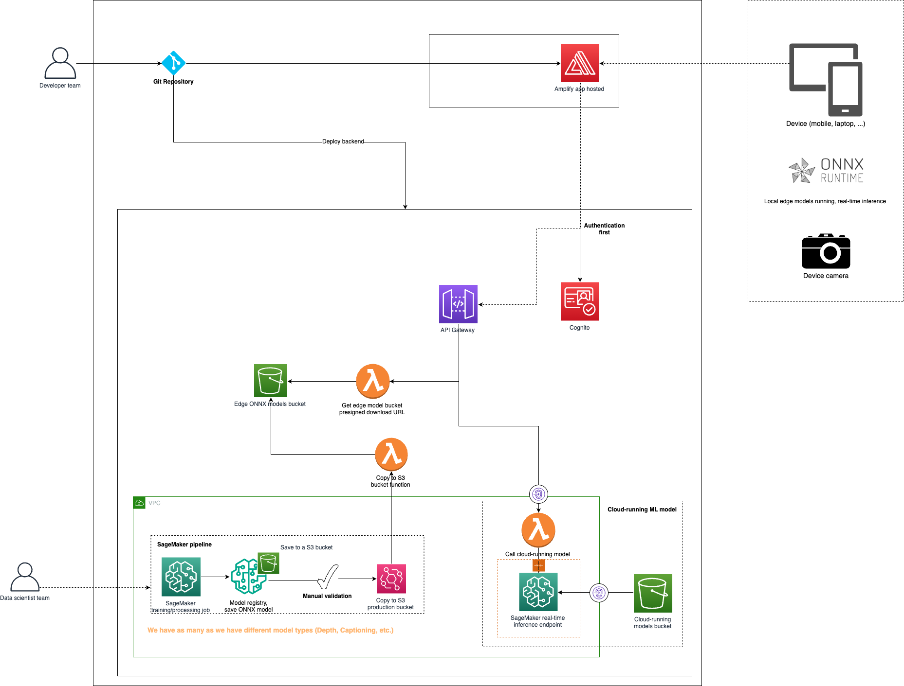

# AWS visual assistant

Helping the visually impaired people. This prototype showcases how foundation models can revolutionize care and assist the visually impaired by alerting dangerous situations. It runs machine learning models both at the edge and in Amazon Sagemaker, giving both options.

> **General disclaimer**
> 1. This software is meant for development purposes. It does not claim to be immune from security issues, especially regarding the frontend web application or potential bugs. For production scenarios, it is your responsibility to ensure proper security measures for your users, and that the software meets defined security criterias and regulations for your area.
> 2. Cloud deployments can incur cost on your AWS accounts. Make sure to plan this accordingly and check for the prices in your region of deployment.
> 3. Some features might be unavailable for deployment in specific regions.

# Instructions for deployment

## If you plan to use AWS Amplify for frontend hosting

To deploy it, there are only 4 steps:
1. Fork this GitHub repository.
2. Create IAM Role to allow Amplify to deploy AWS cloud resources.
3. Deploy using AWS Amplify
    - To automatically trigger the SageMaker Pipelines for all models and approve automatically (so they are available in the UI) set the following environment variables:
        - TRIGGER_PIPELINES=true   # if false, you must manually trigger the SageMaker Pipelines in SageMaker Studio
        - AUTO_APPROVE_MODELS=true  # if TRIGGER_PIPELINES=false or AUTO_APPROVE_MODELS=false, you must manually approve the models in SageMaker Studio
4. Create a user in Cognito User Pool for yourself.

Enjoy!


### Detailed instructions:

1. First follow the [frontend instructions](./visual_assistant_js/README.md) to deploy the web-app to Amplify. Once the application is deployed, populate the infrastructure by following [backend instructions](./backend/README.md) file. You need to create the Amplify application before as it will be modified by the backend deployment. **The first build of the Amplify application might faill because it awaits for backend deployment.**

2. Create IAM Role for Amplify: [follow these steps](https://docs.aws.amazon.com/amplify/latest/userguide/amplify-service-role.html). After you have the role, add select it in the IAM console, add the managed policy "AmplifyBackendDeployFullAccess" and add this inline policy for SageMaker:
```json
{
    "Version": "2012-10-17",
    "Statement": [
        {
            "Sid": "SageMakerPipelines",
            "Effect": "Allow",
            "Action": [
                "sagemaker:ListPipeline*",
                "sagemaker:DescribePipeline*",
                "sagemaker:CreatePipeline",
                "sagemaker:DeletePipeline",
                "sagemaker:UpdatePipeline",
                "sagemaker:UpdatePipelineExecution",
                "sagemaker:StartPipelineExecution",
                "sagemaker:StopPipelineExecution",
                "sagemaker:AddTags",
                "sagemaker:ListTags"
            ],
            "Resource": "*"
        }
    ]
}
```

3. To deploy the Webapp to Amplify, you can go into the Amplify console on you AWS account and click on deploy a new app. You will then be prompted to setup a Github integration between Amplify on your AWS account and your Github account. **Ideally you have your own version (Fork) of the GitHub, to avoid any issue with the public repository.**

You can limit AWS integration to solely access the frontend repository. Just follow the instructions and select the correct Github branch to deploy the application. 

To enable automatic deployment of ML models (trigger ML pipelines and register them so the frontend can load), in the build click on "Advanced settings" and add 2 environment variables:
- TRIGGER_PIPELINES=true
- AUTO_APPROVE_MODEL=true

> Note that after every push to this repository you will be triggering the ML pipelines and registering the models if the variables are set to 'true'. If you don't want that after the first deployment, go to your Amplify app, select 'Hosting' > 'Environment Variables' > 'Manage variables' and then 'Action' > 'Remove variable' for both TRIGGER_PIPELINES and AUTO_APPROVE_MODEL and finally click 'Save'.


7. Cleaning up

To clean up all resource go please follow those instructions to [delete the backend (section '3. Backend resources destruction')](./backend/README.md). Then go to the Amplify console, to your app, select 'App settings' > 'General settings' and 'Delete app'.

## (Development) If your frontend runs on your local machine or a web server

This is the way to go if you do not want the frontend to be hosted on Amplify.
First follow the [backend instructions](./backend/README.md) file to deploy backend resources. Once they are properly deployed, follow the [frontend instructions](./visual_assistant_js/README.md) to deploy the web-app to your machine.

# Architecture




# Development Team

- [Marcelo Cunha](https://www.linkedin.com/in/marcelokscunha/)
- [Gauthier Lambert](https://www.linkedin.com/in/gauthier-lambert/)
- [Simon Poulet](https://www.linkedin.com/in/simonpoulet2)
- [Jingfang Yuan](https://www.linkedin.com/in/jingfang-yuan-8a4a76212/)

# Security

See [CONTRIBUTING](CONTRIBUTING.md#security-issue-notifications) for more information.

# License

This library is licensed under the MIT-0 License. See the LICENSE file.
