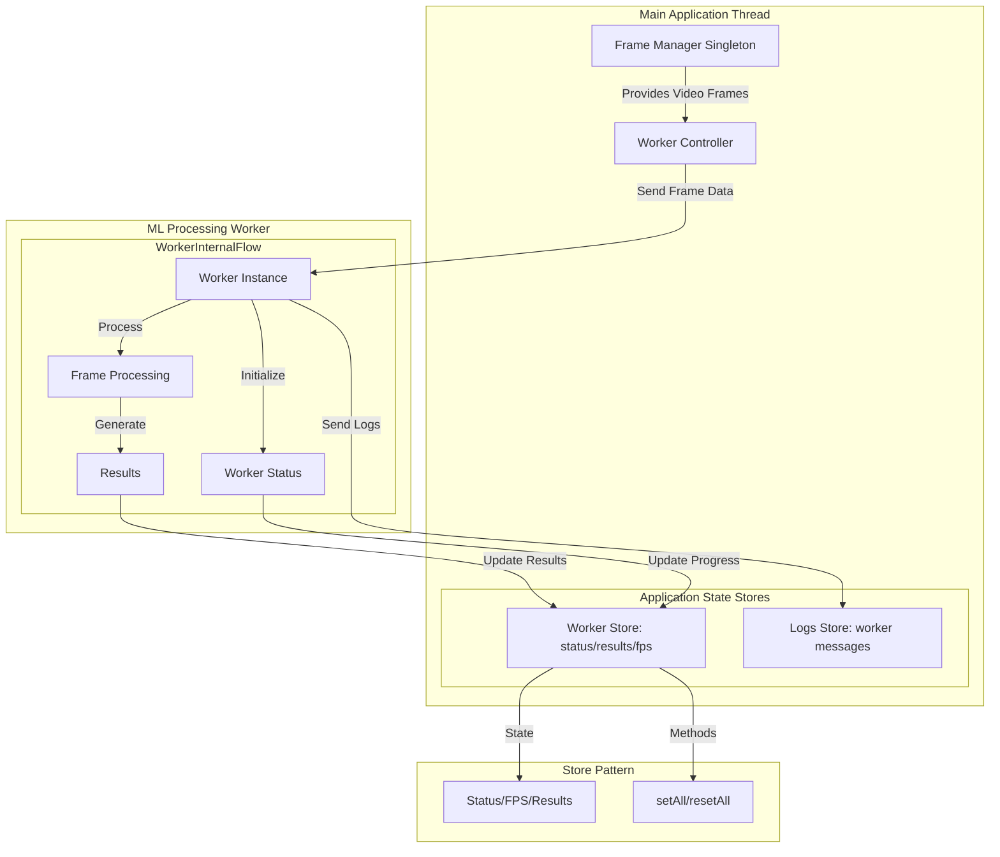
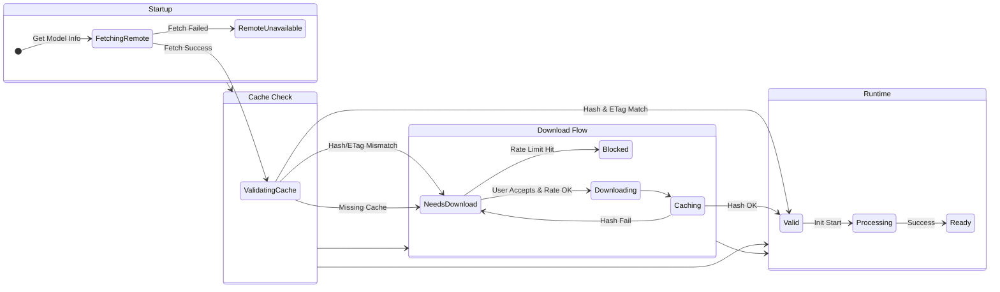
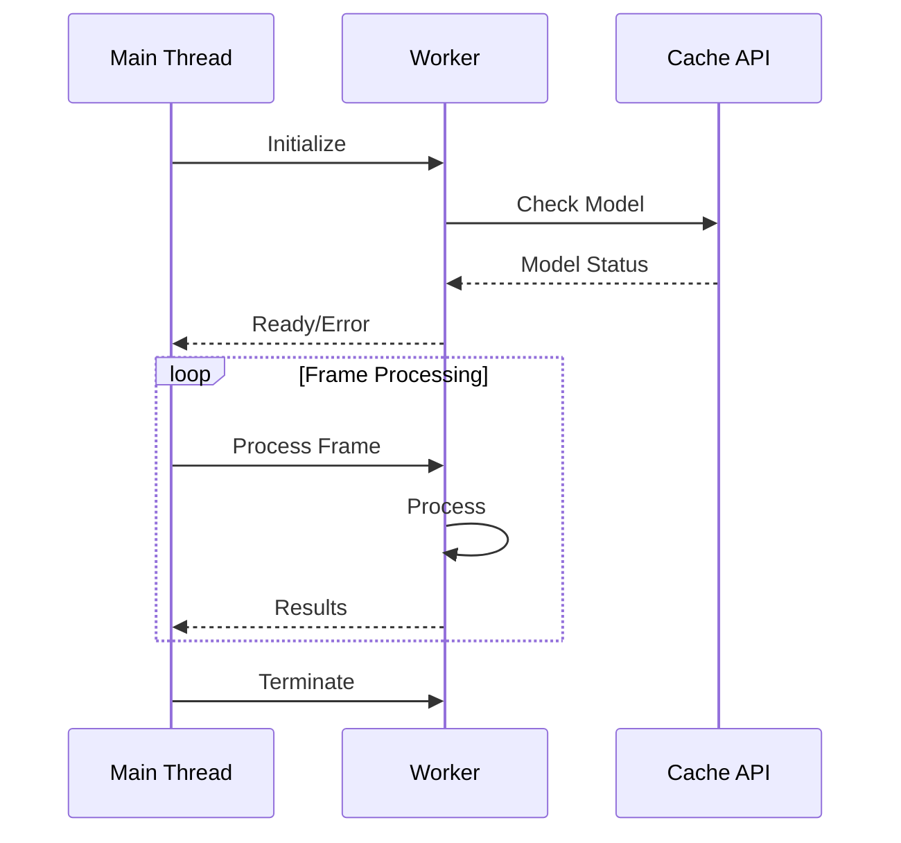
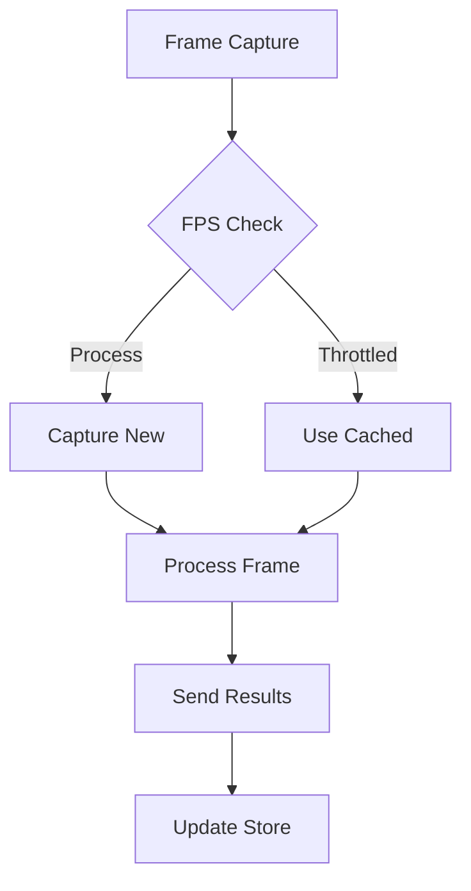

# How to Add/Modify a Model Worker

This guide explains how to add or modify a model worker in the system. The worker system is designed to process frames from video input using machine learning models in a non-blocking way.

## Architecture Overview

The worker system consists of several key components that work together:

1. **Frame Management**
   - `FrameManager` (singleton) handles frame capture and throttling
   - Captures frames once and shares them across workers
   - Maintains FPS control (default 30 FPS)

2. **Model Management**
   - Models are downloaded and cached using the browser's Cache API
   - Models are validated using partial hashing for efficiency

3. **Worker Components**
   - Worker script (e.g., detection-worker.js)
   - React hook for worker control (e.g., useDetectionProcessing.js)
   - Store for worker state management (e.g., detectionStore.js)

## Adding a New Worker

### 1. Create the Worker Script

Create a new file in `src/app/workers/your-worker.js`:

```javascript
import { setupWorkerLogging } from 'src/app/utils/workerLogging.js';

// Configure environment
env.allowLocalModels = true;
env.allowRemoteModels = false;
env.backends.onnx.wasm.proxy = true;
env.localModelPath = '/models/';

// Setup worker logging
setupWorkerLogging('your-worker-name', self);

// Initialize state
let model = null;
let isInitialized = false;

// Create model pipeline class
class YourModelPipeline {
  static model = 'your-model-name';
  static device = 'wasm';

  static async getInstance(progress_callback = null) {
    // Device selection logic
    this.device = navigator.gpu ? 'webgpu' : 'wasm';
    
    // Initialize model
    this.model = await AutoModel.from_pretrained(this.model, {
      device: this.device,
      progress_callback
    });
    
    return this;
  }
}

// Initialize worker
async function initialize() {
  try {
    model = await YourModelPipeline.getInstance((progress) => {
      self.postMessage({
        status: 'loading',
        progress
      });
    });

    isInitialized = true;
    self.postMessage({
      status: 'ready',
      device: YourModelPipeline.device
    });
  } catch (error) {
    self.postMessage({
      status: 'error',
      error: error.message
    });
  }
}

initialize();

// Handle messages
self.addEventListener('message', async (event) => {
  if (!isInitialized) {
    self.postMessage({
      status: 'busy',
      message: 'Model is still initializing'
    });
    return;
  }

  if (event.data.type === 'process') {
    // Process frame
    const result = await processFrame(event.data.frame);
    
    // Send results
    self.postMessage({
      status: 'complete',
      result
    });
  }
});
```

### 2. Create the React Hook

Create a new file in `src/app/hooks/useYourWorkerProcessing.js`:

```javascript
'use client';
import { useRef } from 'react';
import { useYourWorkerStore } from 'src/app/stores/yourWorkerStore';
import { useLogsStore } from 'src/app/stores/logsStore';
import FrameManager from 'src/app/utils/frameManager';

export function useYourWorkerProcessing() {
  const worker = useRef(null);
  
  // Get store actions
  const setWorkerState = useYourWorkerStore(state => state.setWorkerState);
  const addLog = useLogsStore(state => state.addLog);

  function handleMessage(e) {
    switch (e.data.status) {
      case 'ready':
        setWorkerState({ status: 'ready' });
        break;
      case 'complete':
        // Handle results
        break;
      // ... other status handlers
    }
  }

  const initializeWorker = () => {
    if (!worker.current) {
      worker.current = new Worker(
        new URL('../workers/your-worker.js', import.meta.url),
        { type: 'module' }
      );
      worker.current.addEventListener('message', handleMessage);
    }
  };

  const terminateWorker = () => {
    if (worker.current) {
      worker.current.terminate();
      worker.current = null;
    }
  };

  return { initializeWorker, terminateWorker };
}
```

### 3. Create the Store

Create a new file in `src/app/stores/yourWorkerStore.js`:

```javascript
import { create } from 'zustand';

export const useYourWorkerStore = create((set) => ({
  workerState: {
    status: 'idle',
    error: null
  },
  results: null,
  setWorkerState: (state) => set((prev) => ({
    workerState: { ...prev.workerState, ...state }
  })),
  setResults: (results) => set({ results }),
  resetState: () => set({
    workerState: { status: 'idle', error: null },
    results: null
  })
}));
```

### 4. Register the Worker

Update `WORKER_TO_MODEL_MAP` in `globals.js`:

```javascript
export const WORKER_TO_MODEL_MAP = {
  // ... existing workers
  yourWorker: ['your-model-name']
};
```

## Key Concepts

1. **Frame Processing**
   - Workers receive frames through the `FrameManager`
   - Processing is throttled based on FPS settings
   - Results are sent back to main thread via `postMessage`

2. **Worker Lifecycle**
   - Workers are initialized on demand
   - Models are loaded asynchronously with progress tracking
   - Workers can be terminated to free resources

3. **Logging System**
   - Debug logs can be enabled per worker
   - Logs are captured and displayed in UI
   - Console methods are overridden in worker context

4. **Model Management**
   - Models are downloaded and cached
   - Cache validation uses partial hashing
   - Support for different model formats

### Worker System Architecture




### Model Lifecycle



### Worker Message Flow



## Key Concepts

### 1. Model Validation and Download Flow

The system uses a sophisticated validation and download process:

1. **Initial Check**
   ```mermaid
   flowchart LR
       A[Start] --> B{Cache Check}
       B -->|Exists| C{Validate Hash}
       B -->|Missing| D[Need Download]
       C -->|Valid| E[Ready]
       C -->|Invalid| D
   ```

   - System checks if model exists in Cache API
   - Validates model files using partial hashing
   - Determines if download is needed

2. **Download Determination**
   - Triggered by:
     * Missing model files
     * Invalid hash validation
     * New version available
   - Controlled by `serviceSelectionStore`
   - Progress tracking through download and caching phases

### 2. Message Types

Workers use a standardized message system:

1. **Control Messages**
   - `initialize`: Start worker and load model
   - `terminate`: Clean up and stop worker
   - `process`: Request frame processing

2. **Status Messages**
   ```javascript
   {
     status: 'ready' | 'loading' | 'error' | 'complete' | 'busy',
     // Additional fields based on status
   }
   ```

3. **Progress Messages**
   ```javascript
   {
     status: 'loading',
     progress: number // 0-100
   }
   ```

4. **Result Messages**
   ```javascript
   {
     status: 'complete',
     results: any,
     fps: number
   }
   ```

### 3. Frame Processing Workflow



1. **Frame Acquisition**
   - Managed by `FrameManager` singleton
   - FPS throttling (default 30 FPS)
   - Frame sharing across workers

2. **Processing Pipeline**
   - Frame preprocessing
   - Model inference
   - Result post-processing

3. **Result Handling**
   - Store updates
   - UI updates
   - Logging

## Common Modifications

1. **Changing Model Parameters**
   - Update model configuration in worker
   - Add new parameters to store
   - Update processing logic

2. **Adding New Features**
   - Extend worker message handling
   - Add new state to store
   - Update React hook accordingly

3. **Performance Optimization**
   - Adjust frame throttling
   - Optimize model parameters
   - Implement caching strategies

Remember to test thoroughly after making modifications, especially around worker initialization, frame processing, and cleanup.